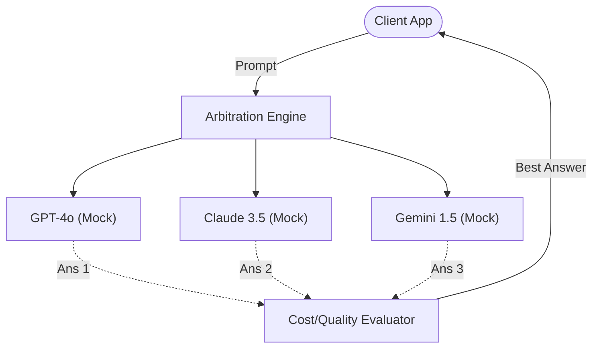

# Architecture — llm-output-arbitration
> Last updated: 2026-08-29 | Maturity: Partial Prototype
> _LLM consensus and arbitration engine._

## System Diagram

## Component Table
| Component | File | Responsibility | Tech |
|---|---|---|---|
| Arbitrator | `src/arbitrator/`| Manages parallel LLM calls | Python Asyncio |
| Evaluator | `src/evaluator/`| Scores answers on cost/speed/quality | Python |
| API | `server/`| REST Interface | FastAPI |

## Dependency Honesty Table
| Dependency | Status | Notes |
|---|---|---|
| Providers | **Mocked** | Currently uses static test fixtures for LLM responses to avoid API costs during evaluation. |
