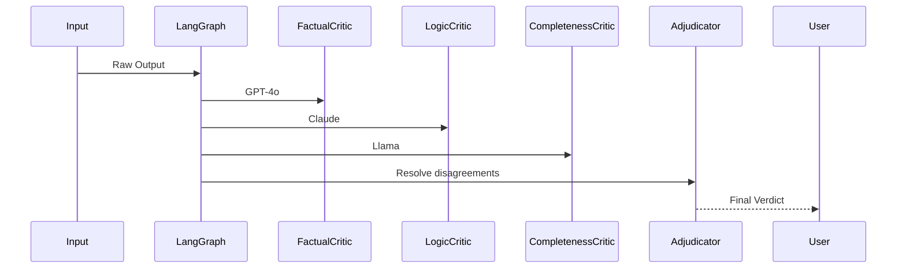

# Architecture: LLM Output Arbitration System

## System Diagram
The following Mermaid.js sequence diagram maps the core workflow and interactions:

## Component Breakdown
- **Core Technology**: Python, LangGraph, Pydantic
- **Design Paradigm**: Emphasizes high availability, fault tolerance, and security.
